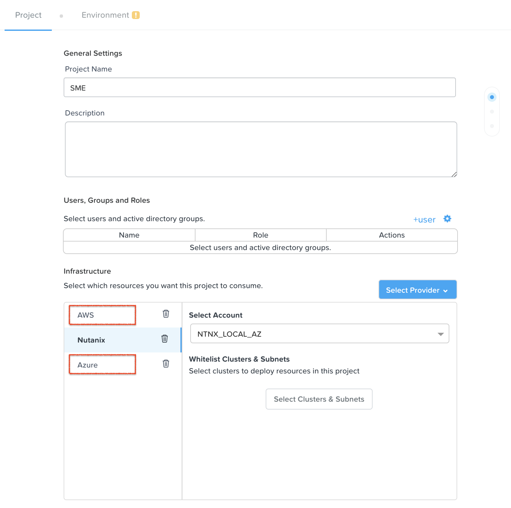

.. _calm_cloud_sdk:

================================================
Extending Calm automation with Public Cloud SDKs
================================================

.. note::

  This exercise requires to have an AWS or Azure account and its access keys or service principals.

.. note::

  Estimated time to complete: **60 MINUTES**

--------
Overview
--------

Out of the box Calm provides just virtual machine provisioning. When it comes to public cloud, many times there are other native services that are part of an application like could be *object storage*, *database services*, and others. 

Since Calm 2.9.7 the Python SDKs for AWS and Azure were included. With these SDKs Calm blueprints bring additional flexibility to include any public cloud service as part of your blueprint. As an example, you could have a WordPress application that uses EC2 instaces deployed by Calm natively, database using AWS RDS via AWS SDK in Calm, and a load balancer using AWS ELB or ALB.

---------------
Getting Started
---------------

AWS and Azure SDK can be accessed in Calm using eScript. The following two examples show how to enable the SDK in your eScript task or variable:

- **AWS**:

  .. code-block:: python

    import boto3

  For more details you can visit the `AWS Boto 3 documentation <https://boto3.amazonaws.com/v1/documentation/api/latest/index.html>`_

- **Azure**:

  .. code-block:: python

    from azure.common.credentials import ServicePrincipalCredentials

    # If we want to operate Azure Resource Groups, then we need to import the right module
    from azure.mgmt.resource import ResourceManagementClient

  For more details you can visit the `Azure Python documentation <https://docs.microsoft.com/en-us/python/api/?view=azure-python>`_

Lab
+++

You are going to build your personal blog using WordPress. The application will use the managed database service by AWS and Azure. Your blueprint includes:

- Two services: WordPress PHP and MySQL database
- WordPress PHP service is installed in a virtual machine using Calm providers
- MySQL service is based on AWS RDS and Azure Databases
- Single blueprint that uses two profiles to deploy on both clouds. One profile for AWS, another one for Azure.

.. note:

  AWS and Azure providers have been already configured for you.

1. Update project with public providers
***************************************

Update your Calm project to include the two providers, AWS and Azure. You don't need to configure them in the environment tab.

2. Create a multi-machine blueprint
***********************************

#. Name: **<INITIALS>-SDK**

#. Description:

   .. code-block:: text
     
     [WordPress](http://@@{Apache.address}@@/)

   .. figure:: images/sdk_02.png

#. Create a credential for the operating system.

   - Name: **Cred_OS**
   - Username: **nutanix**
   - Secret Type: Password
   - Password: **NutanixCalm/4u** 
   - Use as default: **Yes**

#. Create a credential for the database user.

   - Name: **Cred_DB**
   - Username: **mysqladmin**
   - Secret Type: Password
   - Password: **Calm.123** 
   - Use as default: **No**

   .. figure:: images/sdk_03.png

3. Create WordPress service
***************************

#. Add a service with following settings:

   - Service Name: **Apache**

   - VM:

     - Name: **ApacheAWS**
     - Cloud: **AWS**
     - Account Id: <Depends on the setup>
     - Operating System: **Linux**
     - Instance Name: <Leave default>
     - Associate Public IP Address: **Yes**
     - Instance Type: **t2.micro**
     - Region: **eu-west-2**

     .. figure:: images/sdk_04.png

     - Availability Zone: **eu-west-2a**
     - Machien Image: **CentOS 7 x86_64**
     - IAM Role: <Empty>
     - Key Pairs: **id_rsa_OpenSSH**
     - VPC: **172.31.0.0/16 | vpc-29354341**
     - Security Group: **launch-wizard-1**
     - Subnet: **subnet-562eab2c | vpc-29354341**
     - User Data:

       .. code-block:: bash
   
         #cloud-config
         hostname: @@{name}@@
         users:
           - name: @@{Cred_OS.username}@@
             sudo: ['ALL=(ALL) NOPASSWD:ALL']
         chpasswd:
           list: |
             @@{Cred_OS.username}@@:@@{Cred_OS.secret}@@
           expire: False
         ssh_pwauth: True

     .. figure:: images/sdk_05.png

     - Leave the remaining default values
   
   - Click **Save**

#. Create Docker-based WordPress installation tasks.

   To make reusable the WordPress installation across Calm Profiles, AWS and Azure, the tasks must be created in the *Create* stage of the WordPress service.

   - On the left pane, expand **Service**, **Apache** and click **Create**
   - On the center of the screen, click **+ Task**
   - On the right pane, complete with:

     - Task Name: **Install Docker**
     - Type: **Execute**
     - Script Type: **Shell**
     - Credential: <empty> 
     - Script:

       .. code-block:: bash
     
         # Uninstall old versions
         sudo yum remove -y docker \
             docker-client \
             docker-client-latest \
             docker-common \
             docker-latest \
             docker-latest-logrotate \
             docker-logrotate \
             docker-engine

         # Set up the repository
         sudo yum install -y yum-utils
         sudo yum-config-manager \
             --add-repo \
             https://download.docker.com/linux/centos/docker-ce.repo

         # Install the latest version of Docker Engine
         sudo yum install -y docker-ce docker-ce-cli containerd.io

         # Enable and start Docker
         sudo systemctl enable docker
         sudo systemctl start docker

         # Add current user to Docker
         sudo usermod -aG docker $USER

       .. figure:: images/sdk_06.png

   - Add an additional task, click **+ Task**

     - Task Name: **Install WordPress**
     - Type: **Execute**
     - Script Type: **Shell**
     - Credential: <empty> 
     - Script: 
        .. code-block:: bash
     
          export WORDPRESS_DB_HOST=@@{MySQL.address}@@
          export WORDPRESS_DB_USER=@@{Cred_DB.username}@@
          export WORDPRESS_DB_PASSWORD=@@{Cred_DB.secret}@@

          docker run \
            --name calm-wordpress \
            --restart always \
            -p 80:80 \
            -e WORDPRESS_DB_HOST=$WORDPRESS_DB_HOST \
            -e WORDPRESS_DB_USER=$WORDPRESS_DB_USER \
            -e WORDPRESS_DB_PASSWORD=$WORDPRESS_DB_PASSWORD \
            -d wordpress

        .. figure:: images/sdk_07.png

   - Click **Save**

4. Create MySQL service
*************************

It is now when you are going to use the SDKs for AWS and Azure available in Calm. Because Calm is not responsible for deploying the database instance, we are going to use an **Existing Machine** service.

The database instance creation is delegated to the managed database service by AWS and Azure. In this first part you are going to focus on AWS RDS. Because you need to "pause" the WordPress service deployment until the database is ready, the MySQL SDK automation is configured during its **pre-create** stage.

#. Add a service with following settings:

   - Service Name: **MySQL**

   - VM:

     - Name: **MySQLAWS**
     - Cloud: **Existing Machine**
     - Operating System: **Linux**
     - IP Address: **@@{RDS_DB_IP}@@** | Look closely, this is a macro. During a pre-create task you will set a variable called **RDS_DB_IP** with the MySQL FQDN/IP address. The purpose is not for Calm to connect via SSH since that's not possible with RDS, it's to "pause" the WordPress installation until the MySQL instance is ready.
     - Check log-in upon create: **No**

     .. figure:: images/sdk_08.png

     - Leave the remaining default values
     - Click **Save** (Ignore any error)

#. Create AWS RDS MySQL with AWS SDK.

   .. note::

     For reference the AWS SDK you will use can be find in this link.
     https://boto3.amazonaws.com/v1/documentation/api/latest/reference/services/rds.html#RDS.Client.create_db_instance

   - On the left pane, expand **Service**, **MySQL**, **VM**, **Pre-create**
   - On the center of the screen, click **+ Task**
   - On the right pane, complete with:

     - Task Name: **RDS Create MySQL**
     - Type: **Set Variable**
     - Script Type: **EScript**
     - Output: **RDS_DB_IP** | This variable will get the FQDN/IP address of the RDS instance that is used by the **Existing Machine** IP address.
     - Script:
     
       .. code-block:: python

        AWS_ACCESS_KEY = '@@{AWS_ACCESS_KEY}@@'
        AWS_SECRET_KEY = '@@{AWS_SECRET_KEY}@@'
        AWS_REGION = '@@{AWS_REGION}@@'
        AWS_RDS_INSTANCE = '@@{calm_application_uuid}@@'
        MYSQL_USERNAME = '@@{Cred_DB.username}@@'
        MYSQL_PASSWORD = '@@{Cred_DB.secret}@@'

        import boto3
        from boto3 import setup_default_session

        setup_default_session(
            aws_access_key_id=AWS_ACCESS_KEY,
            aws_secret_access_key=AWS_SECRET_KEY,
            region_name=AWS_REGION
        )

        client = boto3.client('rds')

        response = client.create_db_instance(
            AllocatedStorage=5,
            DBInstanceClass='db.t2.micro',
            DBInstanceIdentifier=AWS_RDS_INSTANCE,
            Engine='MySQL',
            MasterUserPassword=MYSQL_PASSWORD,
            MasterUsername=MYSQL_USERNAME,
        )

        waiter = client.get_waiter('db_instance_available')
        waiter.wait(DBInstanceIdentifier=AWS_RDS_INSTANCE)

        response = client.describe_db_instances(DBInstanceIdentifier=AWS_RDS_INSTANCE)

        print("RDS_DB_IP={}".format(response['DBInstances'][0]['Endpoint']['Address']))

       .. figure:: images/sdk_09.png

     - Click **Save** (Ignore any warning)

#. Delete AWS RDS MySQL with AWS SDK.

   - On the left pane, expand **Service**, **MySQL**, **VM**, **Post-delete**
   - On the center of the screen, click **+ Task**
   - On the right pane, complete with:

     - Task Name: **RDS Delete MySQL**
     - Type: **Execute**
     - Script Type: **EScript**
     - Script:
     
       .. code-block:: python

         AWS_ACCESS_KEY = '@@{AWS_ACCESS_KEY}@@'
         AWS_SECRET_KEY = '@@{AWS_SECRET_KEY}@@'
         AWS_REGION = '@@{AWS_REGION}@@'
         AWS_RDS_INSTANCE = '@@{calm_application_uuid}@@'
         
         import boto3
         from boto3 import setup_default_session
         
         setup_default_session(
             aws_access_key_id=AWS_ACCESS_KEY,
             aws_secret_access_key=AWS_SECRET_KEY,
             region_name=AWS_REGION
         )
         
         client = boto3.client('rds')
         
         response = client.delete_db_instance(
             DBInstanceIdentifier=AWS_RDS_INSTANCE,
             SkipFinalSnapshot=True
         )
         
         waiter = client.get_waiter('db_instance_deleted')
         waiter.wait(DBInstanceIdentifier=AWS_RDS_INSTANCE)
         
         print("RDS Instance deleted.")

       .. figure:: images/sdk_09b.png

     - Click **Save** (Ignore any warning)

5. Create Profile Variables
***************************

Next step is to create the profile variables: **AWS_ACCESS_KEY, AWS_SECRET_KEY and AWS_REGION**

#. Click the **Default Application Profile**

#. Rename the profile from *Default* to **AWS**

#. Use the table below to create the variables:

   +------------------------+-----------------+---------------------------+---------------+
   | **Variable**           | **Secret**      | **Value**                 | **Private**   |
   +------------------------+-----------------+---------------------------+---------------+
   | **AWS_ACCESS_KEY**     | Yes             | Provided by instructor    | Yes           |
   +------------------------+-----------------+---------------------------+---------------+
   | **AWS_SECRET_KEY**     | Yes             | Provided by instructor    | Yes           |
   +------------------------+-----------------+---------------------------+---------------+
   | **AWS_REGION**         | No              | eu-west-2                 | No            |
   +------------------------+-----------------+---------------------------+---------------+

   .. figure:: images/sdk_10.png

6. Create Service Dependency
****************************

You need to create a manual dependency from the **Apache** service to **MySQL**.

#. Click the **Apache** box in the workspace

#. Click the **Create Dependency** icon and drag the arrow to connect with **MySQL**

   .. figure:: images/sdk_11.png

#. Click **Save** (if you have received any warning or error, please fix them)

7. Launch Blueprint
*******************

#. Click **Launch**

   - Name of the Application: **<INITIALS>-AWS-WP-1**
   - Click **Create**

     .. figure:: images/sdk_12.png

     .. note::

       The deployment takes about 10 minutes. You can continue the lab and check back later.

#. Once the application is in **Running** state, click **Overview**

#. Under **Overview** there is a link for **WordPress**, right click and open the link in a new tab.

   .. figure:: images/sdk_12b.png

8. Adding Azure Profile
***********************

Using the same blueprint you just created is going to be used for deploying the same application on Azure using the same approach. Calm to deploy the compute instance with the native support, and for the MySQL DB you will use the Azure SDK.

#. Add a new **Application Profile** doing click in the **+** near to this.

#. Change the **Application Profile Name** to **Azure**.

   .. figure:: images/sdk_13.png

9. Configure WordPress service for Azure
****************************************

#. Click the Apache service and use the following settings:

   - Service Name: Leave *Apache*, do not change it

   - VM:

     - Name: **ApacheAZ**
     - Cloud: **Azure**
     - Operating System: **Linux**

     .. figure:: images/sdk_14.png

   - VM Configuration:

     - Instance Name: <Leave default>
     - Resource Group: **UK**
     - Availability Set: <empty>
     - Location: **UK South**
     - Hardware Profile: **Standard_B1s**

     .. figure:: images/sdk_15.png

   - OS Profile:

     - Cloud Init Script:

       .. code-block:: bash
   
         #cloud-config
         hostname: @@{name}@@
         users:
           - name: @@{Cred_OS.username}@@
             sudo: ['ALL=(ALL) NOPASSWD:ALL']
         chpasswd:
           list: |
             @@{Cred_OS.username}@@:@@{Cred_OS.secret}@@
           expire: False
         ssh_pwauth: True

     .. figure:: images/sdk_16.png

   - Storage Profile:

     - Expand **VM Image Details** (do not select *Use Custom Image* box)
     - Publisher: **OpenLogic**
     - Offer: **CentOS**
     - SKU: **7_8**
     - Version: **7.8.2020051900**
     - Click **Confirm Image Change**

     .. figure:: images/sdk_17.png

   - Network Profiles:

     - Click **+** to add a network profile
     - NIC-1 - NIC Name: <Leave default>
     - NIC-1 - Security Group: **calmnsg**
     - NIC-1 - Virtual Network: **calmvn**
     - NIC-1 - Subnet: **default**

     .. figure:: images/sdk_18.png

   - Leave the remaining default values
   - Click **Save** (Ignore any error)

#. In Azure Database for MySQL the allowed connection from WordPress to MySQL must be created. For this you are going to create the task in the **package install**.

   - Make sure you click the **Apache** service and use the following settings:
   - Click **Package**
   - Click **Configure install**
   - In the workspace, click the **+ Task**
   - Task Name: **Create MySQL Firewall Rule**
   - Type: **Execute**
   - Script Type: **EScript**
   - Script:

     .. code-block:: python

       AZ_SUBSCRIPTION_ID = '@@{AZURE_SUBSCRIPTION_ID}@@'
       AZ_CLIENT_ID = '@@{AZURE_CLIENT_ID}@@'
       AZ_TENANT_ID = '@@{AZURE_TENANT_ID}@@'
       AZ_SECRET = '@@{AZURE_SECRET}@@'
       AZ_RESOURCE_GROUP_NAME = '@@{AZURE_RESOURCE_GROUP}@@'
       MYSQL_NAME = '@@{calm_application_uuid}@@'
       
       from azure.common.credentials import ServicePrincipalCredentials
       from azure.mgmt.rdbms.mysql import MySQLManagementClient
       
       def get_credentials():
           subscription_id = AZ_SUBSCRIPTION_ID
           credentials = ServicePrincipalCredentials(
               client_id=AZ_CLIENT_ID,
               secret=AZ_SECRET,
               tenant=AZ_TENANT_ID
           )
           return credentials, subscription_id
           
       credentials, subscription_id = get_credentials()
       client = MySQLManagementClient(credentials,subscription_id)
       
       # Open access to this server for IPs
       rule_creation_poller = client.firewall_rules.create_or_update(
           AZ_RESOURCE_GROUP_NAME,
           MYSQL_NAME,
           'wordpress',
           '@@{address}@@',
           '@@{address}@@'
       )
       
       firewall_rule = rule_creation_poller.result()

     .. figure:: images/sdk_18b.png

   - Click **Save** (Ignore any error)

10. Configure MySQL service as Existing Machine
***********************************************

#. Click the MySQL service and use the following settings:

   - Service Name: Leave *MySQL*, do not change it

   - VM:

     - Name: **MySQLAZ**
     - Cloud: **Existing Machine**
     - Operating System: **Linux**
     - IP Address: **@@{AZ_DB_IP}@@** | Look closely, this is a macro. During a pre-create task you will set a variable called **AZ_DB_IP** with the MySQL FQDN/IP address. The purpose is not for Calm to connect via SSH since that's not possible with Azure Database Services, it's to "pause" the WordPress installation until the MySQL instance is ready.
     - Check log-in upon create: **No**

     .. figure:: images/sdk_19.png

     - Leave the remaining default values
     - Click **Save** (Ignore any error)

#. Create Azure Database for MySQL with Azure SDK.

   .. note::

     For reference the Azure SDK you will use can be find in this link.
     https://docs.microsoft.com/en-us/python/api/azure-mgmt-rdbms/azure.mgmt.rdbms?view=azure-python

   - On the left pane, expand **Service**, **MySQL**, **VM**, **Pre-create**
   - On the center of the screen, click **+ Task**
   - On the right pane, complete with:

     - Task Name: **Azure Create MySQL**
     - Type: **Set Variable**
     - Script Type: **EScript**
     - Output: **AZ_DB_IP** | This variable will get the FQDN/IP address of the Azure instance that is used by the **Existing Machine** IP address.
     - Script:
     
       .. code-block:: python

         AZ_SUBSCRIPTION_ID = '@@{AZURE_SUBSCRIPTION_ID}@@'
         AZ_CLIENT_ID = '@@{AZURE_CLIENT_ID}@@'
         AZ_TENANT_ID = '@@{AZURE_TENANT_ID}@@'
         AZ_SECRET = '@@{AZURE_SECRET}@@'
         AZ_RESOURCE_GROUP_NAME = '@@{AZURE_RESOURCE_GROUP}@@'
         AZ_LOCATION = '@@{AZURE_LOCATION}@@'
         MYSQL_NAME = '@@{calm_application_uuid}@@'
         MYSQL_USERNAME = '@@{Cred_DB.username}@@'
         MYSQL_PASSWORD = '@@{Cred_DB.secret}@@'
 
         from azure.common.credentials import ServicePrincipalCredentials
         from azure.mgmt.rdbms.mysql import MySQLManagementClient
         from azure.mgmt.rdbms.mysql.models import ServerForCreate, ServerPropertiesForDefaultCreate, ServerVersion
 
         def get_credentials():
             subscription_id = AZ_SUBSCRIPTION_ID
             credentials = ServicePrincipalCredentials(
                 client_id=AZ_CLIENT_ID,
                 secret=AZ_SECRET,
                 tenant=AZ_TENANT_ID
             )
             return credentials, subscription_id
             
         credentials, subscription_id = get_credentials()
         client = MySQLManagementClient(credentials,subscription_id)
 
         mysql_properties = ServerPropertiesForDefaultCreate(
             administrator_login=MYSQL_USERNAME,
             administrator_login_password=MYSQL_PASSWORD,
             version=ServerVersion.five_full_stop_seven,
             ssl_enforcement='Disabled'
         )
 
         server_properties = ServerForCreate(
             location=AZ_LOCATION,
             properties=mysql_properties
         )
 
         server_creation_poller = client.servers.create(
             AZ_RESOURCE_GROUP_NAME,
             MYSQL_NAME,
             server_properties
         )
 
         server = server_creation_poller.result()
         print("AZ_DB_IP={}.mysql.database.azure.com".format(MYSQL_NAME))

       .. figure:: images/sdk_20.png

     - Click **Save** (Ignore any warning)

#. Create the WordPress Database.

   - Add a second task, click **+ Task**
   - On the right pane, complete with:

     - Task Name: **Create WordPress DB**
     - Type: **Execute**
     - Script Type: **EScript**
     - Script:
     
       .. code-block:: python

         AZ_SUBSCRIPTION_ID = '@@{AZURE_SUBSCRIPTION_ID}@@'
         AZ_CLIENT_ID = '@@{AZURE_CLIENT_ID}@@'
         AZ_TENANT_ID = '@@{AZURE_TENANT_ID}@@'
         AZ_SECRET = '@@{AZURE_SECRET}@@'
         AZ_RESOURCE_GROUP_NAME = '@@{AZURE_RESOURCE_GROUP}@@'
         MYSQL_NAME = '@@{calm_application_uuid}@@'
 
 
         from azure.common.credentials import ServicePrincipalCredentials
         from azure.mgmt.rdbms.mysql import MySQLManagementClient
 
         def get_credentials():
             subscription_id = AZ_SUBSCRIPTION_ID
             credentials = ServicePrincipalCredentials(
                 client_id=AZ_CLIENT_ID,
                 secret=AZ_SECRET,
                 tenant=AZ_TENANT_ID
             )
             return credentials, subscription_id
             
         credentials, subscription_id = get_credentials()
         client = MySQLManagementClient(credentials,subscription_id)
 
         database_creation_poller = client.databases.create_or_update(
             AZ_RESOURCE_GROUP_NAME,
             MYSQL_NAME,
             'wordpress'
         )
 
         database = database_creation_poller.result()

       .. figure:: images/sdk_21.png

#. Delete Azure Database for MySQL with Azure SDK.

   - On the left pane, expand **Service**, **MySQL**, **VM**, **Post-delete**
   - On the center of the screen, click **+ Task**
   - On the right pane, complete with:

     - Task Name: **Azure Delete MySQL**
     - Type: **Execute**
     - Script Type: **EScript**
     - Script:
     
       .. code-block:: python

         AZ_SUBSCRIPTION_ID = '@@{AZURE_SUBSCRIPTION_ID}@@'
         AZ_CLIENT_ID = '@@{AZURE_CLIENT_ID}@@'
         AZ_TENANT_ID = '@@{AZURE_TENANT_ID}@@'
         AZ_SECRET = '@@{AZURE_SECRET}@@'
         AZ_RESOURCE_GROUP_NAME = '@@{AZURE_RESOURCE_GROUP}@@'
         MYSQL_NAME = '@@{calm_application_uuid}@@'
 
         from azure.common.credentials import ServicePrincipalCredentials
         from azure.mgmt.rdbms.mysql import MySQLManagementClient
 
         def get_credentials():
             subscription_id = AZ_SUBSCRIPTION_ID
             credentials = ServicePrincipalCredentials(
                 client_id=AZ_CLIENT_ID,
                 secret=AZ_SECRET,
                 tenant=AZ_TENANT_ID
             )
             return credentials, subscription_id
             
         credentials, subscription_id = get_credentials()
         client = MySQLManagementClient(credentials,subscription_id)

         server_deletion_poller = client.servers.delete(
             AZ_RESOURCE_GROUP_NAME,
             MYSQL_NAME
         )

         server = server_deletion_poller.result()

       .. figure:: images/sdk_22.png

     - Click **Save** (Ignore any warning)

11. Adding Azure Profile Variables
**********************************

Make sure you are in the Azure Application Profile before start adding the following variables

+----------------------------+-----------------+---------------------------+---------------+
| **Variable**               | **Secret**      | **Value**                 | **Private**   |
+----------------------------+-----------------+---------------------------+---------------+
| **AZURE_SUBSCRIPTION_ID**  | Yes             | Provided by instructor    | Yes           |
+----------------------------+-----------------+---------------------------+---------------+
| **AZURE_CLIENT_ID**        | Yes             | Provided by instructor    | Yes           |
+----------------------------+-----------------+---------------------------+---------------+
| **AZURE_TENANT_ID**        | Yes             | Provided by instructor    | Yes           |
+----------------------------+-----------------+---------------------------+---------------+
| **AZURE_SECRET**           | Yes             | Provided by instructor    | Yes           |
+----------------------------+-----------------+---------------------------+---------------+
| **AZURE_RESOURCE_GROUP**   | No              | UK                        | No            |
+----------------------------+-----------------+---------------------------+---------------+
| **AZURE_LOCATION**         | No              | uksouth                   | No            |
+----------------------------+-----------------+---------------------------+---------------+

.. figure:: images/sdk_23.png

- Click **Save**

12. Launch Blueprint
********************

#. Click **Launch**

   - Name of the Application: **<INITIALS>-AZ-WP-1**
   - Application Profile: **Azure**
   - Click **Create**

     .. figure:: images/sdk_24.png

     .. note::

       The deployment takes about 10 minutes.

#. Once the application is in **Running** state, click **Overview**

#. Under **Overview** there is a link for **WordPress**, right click and open the link in a new tab.

   .. figure:: images/sdk_25.png

13. Cleanup
***********

.. note::

  Please delete your running applications to not incur on unnecessary cost

Takeaways
+++++++++

- By using Cloud SDKs the opportunity for new use cases are huge.
- There are tons of documentation available with samples that you can easily adapt.
- This makes Calm as competitive as other solutions with the flexibility to create any kind of cloud objects.