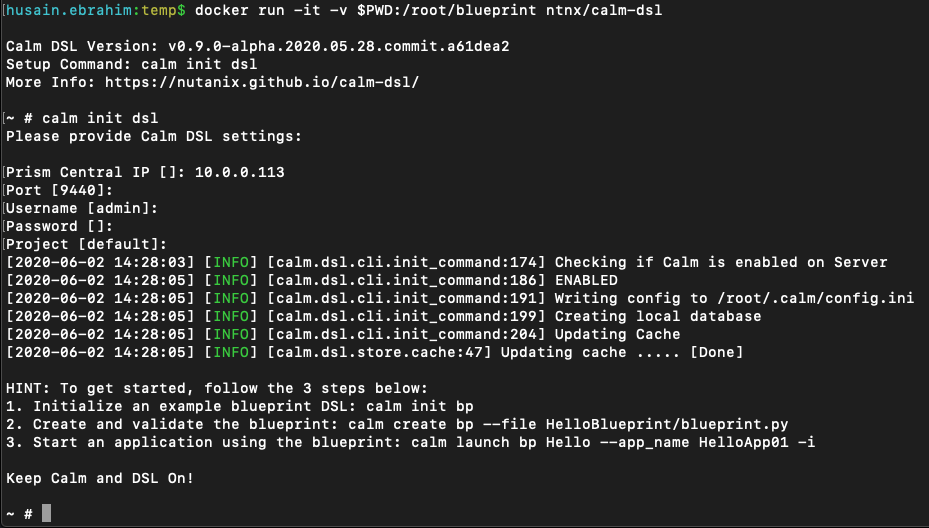

.. comments
..

-----------------------------------
Task 1: Preparing your environment
-----------------------------------

We will first prepare our environment to run calm-dsl. We will run calm-dsl on Docker for this lab.

Install requirements
++++++++++++++++++++

Docker
.......

Make sure you have Docker running on your laptop. To verify that Docker engine is running, run the following command:

.. code-block:: bash
  :name: verify-docker
  :caption: Check docker version

  $ docker --version

If you don't have Docker installed, please refer to the installation instructions here:
MacOS:
Windows:

Running calm-dsl
.................

calm-dsl image is already available on docker hub *ntnx/calm-dsl*, pull the image and run the container

.. code-block:: bash
  :name: pull-image
  :caption: Pull calm-dsl image

  $ docker pull ntnx/calm-dsl

Create a folder to hold you blueprint files for this lab.

.. code-block:: bash
  :name: run-container
  :caption: Run calm-dsl container

  $ mkdir basic_blueprint
  $ cd basic_blueprint
  $ docker run -it -v $PWD:/root/blueprint ntnx/calm-dsl

If everything is ok, you should be presented with container cli.

Initialize calm-dsl
+++++++++++++++++++

Run **calm init dsl** on the cli to initialize calm-dsl with the correct settings.

To validate the settings you can check the status of the PC connecitivty:

.. code-block:: bash
  :name: check-dsl-status
  :caption: Check calm-dsl status

  $ calm get server status

Optional: integration with VSCode
++++++++++++++++++++++++++++++++++

Optionally you can integrate the running container with Visual Studio Code to allow lenting, follow the steps on this blog: https://www.nutanix.dev/2020/04/24/nutanix-calm-dsl-remote-container-development-part-1/
