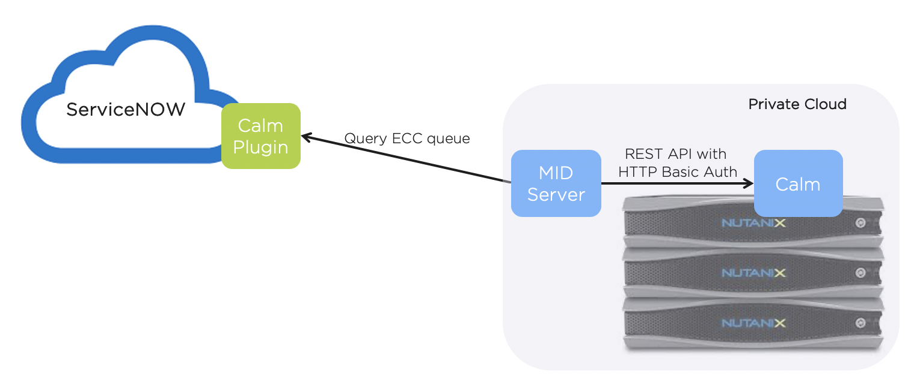
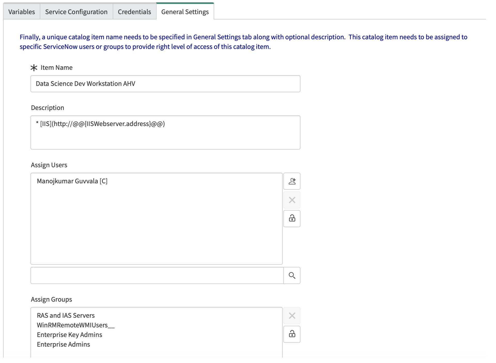
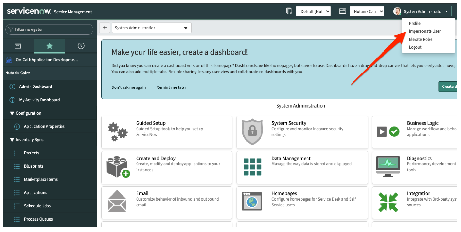
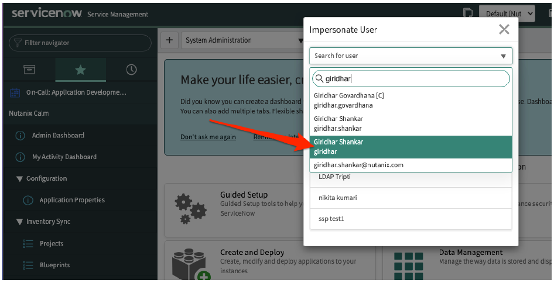
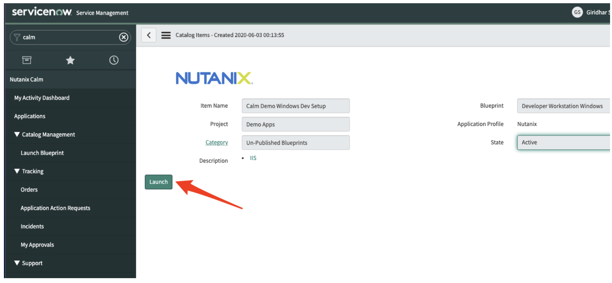
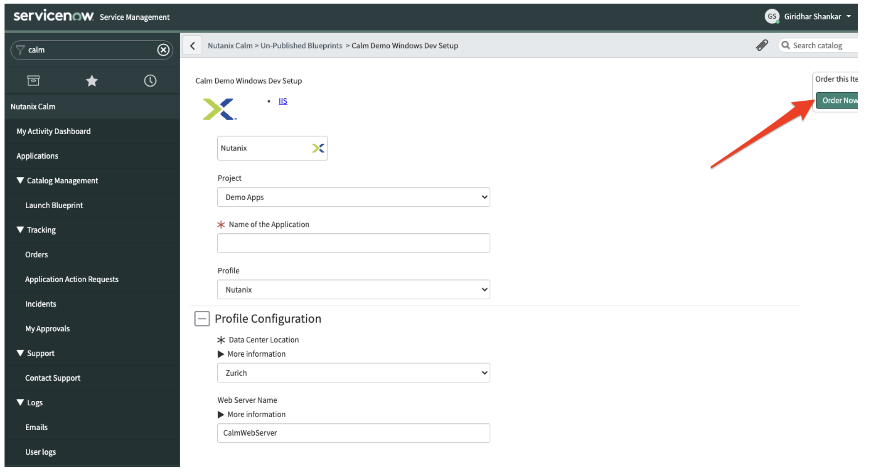
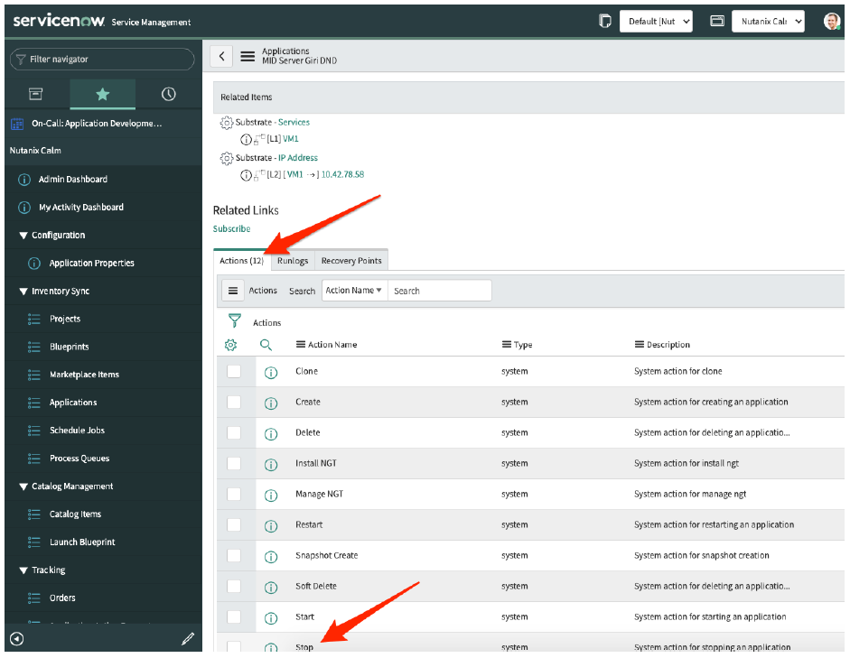
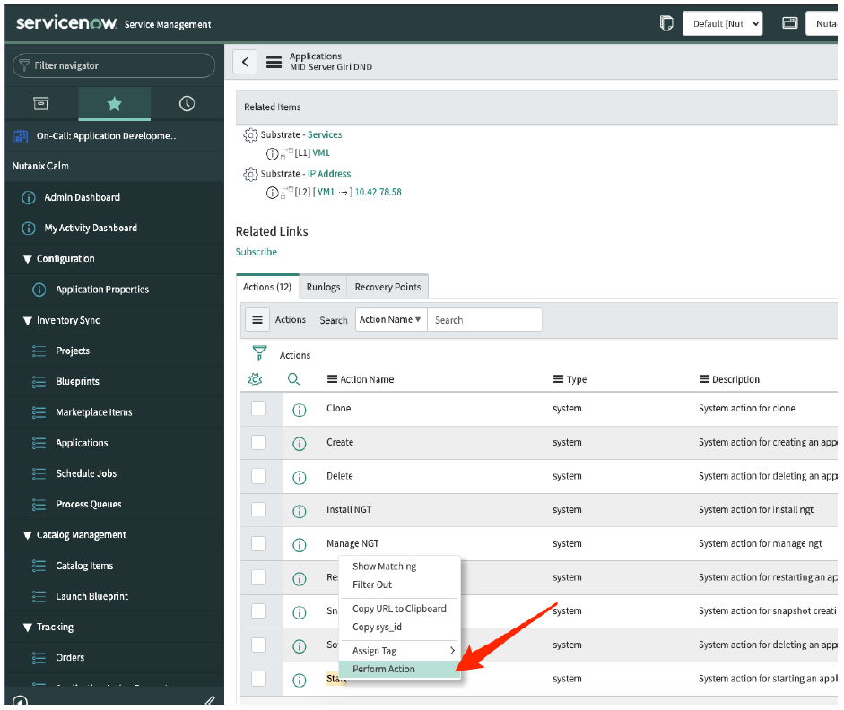

.. _calm_singlevm_blueprint:

=============================
Self-Service with ServiceNow
=============================

.. note::

  Estimated time to complete: **30 MINUTES**

--------
Overview
--------

This workshop is concerned with the Calm ServiceNow Plug-in. Using the Calm serviceNow plug-in Calm provides self-service capabilities via ServiceNow.

In this Lab we will discuss how the Calm ServiceNow Plug-in is set-up, important concepts and step by step guide of how the integration works.

----------------
About ServiceNow
----------------

ServiceNow is a cloud-based service platform providing IT Business Management (ITBM), IT Service Management (ITSM), IT Operations Managament (ITOM). ITSM is concerned with how service are delivered by IT teams while ITOM focuses more on the precesses IT use to manage themselves.

ServiceNow is a market leader in ITSM and ITOM and for many customer ITSM and ITOM are very much embeded in the organisation and serve as the end-customer and IT entry point for requesting and elivering IT services. Large investments are made in to these corporate solutions as they support the business processes based often on ITIL.

.. figure:: images/calm_servicenow_01.png

--------------------------------
Calm ServiceNow Plug-in Overview
--------------------------------

- Provide integration with ServiceNow Service Portal for user self-service of Calm BP or Marketplace items
- Plugin allows ServiceNow admins to create catalog items based on Calm blueprints 
- ServiceNow users can launch blueprints and perform day-2 operations
- ServiceNow admins can attach any specific workflow to ServiceNow Calm catalog,
- ServiceNow catalog items can be created from a blueprint (Single/Multi-VM) on any supported profile; published (i.e., marketplace items) or unpublished blueprints can be used
- ServiceNow admin can pre-fill **runtime** values in ServiceNow catalog item, reducing launch complexity 
- ServiceNow catalog items are published using ServiceNow user/groups RBAC framework (Calm and ServiceNow must share the same authentication source)
- Runlogs can be tracked in ServiceNow GUI under Applications
- Orders and Incidents relating to Calm operations can be tracked in ServiceNow

-----------------------------
Calm ServiceNow Plug-in Setup
-----------------------------

Prerequisites for Nutanix Calm ServiceNow Plug-in

- Nutanix Calm and ServiceNow both must be configured with the same AD or LDAP instance.
- ITSM license that includes incident management module. The license is used to create incidents to report  blueprint and other events launch failures.

.. note::

   Without ITSM license, installation of application from the store does not work as this dependency is bundled with the application.

- ServiceNow MID server must be installed and configured. For information on how to install and configure MID server, refer to the MID Server section in the ServiceNow Documentation. To refer to a video about setting up a MID server, https://www.youtube.com/watch?v=Pgi3WZAqmq0
- Ensure that the MID server is running in your environment. Calm is reachable from the machine or environment where MID server is installed.
- The MID server user has administrator privileges.
- The MID server is up and validated.
- To activate the Calm plug-in on ServiceNow platform, contact your instance ServiceNow administrator.
- You must have administrator privileges to activate and configure the plug-in. Provide integration with ServiceNow Service Portal for user self-service of Calm BP or Marketplace items

----------------
Instance Details
----------------

In this excercise we have provided an instance which maybe used at anytime after the excercise to demonstrate to customerser and prospects.

- Instance Details: https://docs.google.com/document/d/1F6S0SeNpMpcJydlzC0BiahaURBG_IP3ingHugslTHVo/edit?usp=sharing

This ServiceNow instance is connected with https://calm-demo.nutanix.com:9440 instance.

Create Catalogue Instance
+++++++++++++++++++++++++

#. Navigate to **+ Nutanix Calm > Catalog Items**. Click on the **New** button to create a new catalog item

   .. note::

      - When the sync job is running, options to create/edit a catalog item is disabled since CMDB is being updated by the sync job
      - Use the Catalog Management menu under Nutanix Calm in the left navigation bar
      - Ensure your scope is “Nutanix Calm” as indicated in the screen shot belowMousing over an icon will display its title.

   .. figure:: images/calm_servicenow_04.png

#. Project, Blueprint (or MPI) and a Profile are to be selected when creating a catalog item.

   .. note::
      - These cannot be edited later. Choose “Demo Apps” project

   .. figure:: images/calm_servicenow_05.png

#. Choose blueprint **Developer Workstation Window**. This is a demo blueprint already provisioned on the connected Calm instance for this workshop.

#. All the profiles configured in the blueprints are listed under Application Profile field. Choose **Nutanix** and click on **Choose Options** button on the top right/bottom corner.

#. This next page has 4 sub-tabs with various details as configured in the blueprint shows up. As a catalog administrator, you can choose specific values or configure them as runtime in the catalog item.

#. Variables tab displays all the profile variables excluding any private variables. Values (if any) set in the blueprint is displayed here. If this variable is marked runtime in the blueprint, you are allowed to change/set the value in this catalog item. Further, you can choose to remove runtime flag in the catalog item. The plugin renders an order create form corresponding to a catalog item based on only “runtime” variable or VM spec attributes

   .. figure:: images/calm_servicenow_06.png

#. Service configuration tab lists all the services as configured in the blueprint. This page allows you to view/edit the VM specs for each substrate configured as a part of the service in the blueprint. All VM spec attributes marked as runtime in the blueprint can be edited on this page. Further, if you wish to fix/lock a specific value, you can set the value and remove the runtime in this catalog item.

   .. note::
      - Only some of the VM spec attributes can be edited as a part of catalog item definition. Fields like disks, image, guest customization attributes, etc cannot be edited or changed in a catalog item
      - Calm macros and auto completion is not supported in the Calm plugin
   
   .. figure:: images/calm_servicenow_07.png

#. You can leave the credentials as is and move to next tab. In case of multiple credentials configured in a project (in case of MPI launch), this page can be used for credential mapping to the ones used in the blueprint

#. In the **General Setting** tab, specify a unique catalog item name and a description what ServiceNow users will see when they attempt to order this catalog item. 

#. Choose AD/LDAP users/groups who will have visibility to this catalog item in ServiceNow. On saving this catalog item, plugin adds these users or the group users to the corresponding Project in Calm with **consumer** role. Make sure you add yourself as a user who can order this catalog.

#. Under assign user field, search and add your account (as imported from Nutanix AD)

#. Save the catalog item. It may take a few seconds for this operation to be complete. This new catalog item should get listed under the catalog items

Order a Catalog Item
++++++++++++++++++++

#. Login to the vendor instance with admin credentials

#. Impersonate as user **Giridhar Shankar** to open a ServiceNow session as a non-admin user

#. Navigate to **Nutanix Calm > Catalog Management > Launch Blueprint**. Choose **Calm Demo Windows Dev Setup** catalog item under un-published blueprints category

.. note::
  - Search Nutanix in the left navigation bar to get to Calm specific menu
  - Ensure you are logged in as a non-admin (your Nutanix AD account) user
  - You will see this sample catalog item in the catalog items page only if you are added as a catalog item user by the admin (as in the previous section **Creating a Catalog Item**)

.. figure:: images/calm_servicenow_11.png

#. Choose the catalog item and click on **Launch**

#. Catalog order page comes up after a few seconds and only those runtime variables/VM spec attributes

#. Fill-in the name of the Application and click on **Order Now**. This triggers any approval process configured in the plugin (in this case we have configured auto approve) and finally makes a Calm API request to create an App instance using the data in catalog item and user entered input(s)

#. After a few minutes, the Application you created should get listed under the Applications menu in the plugin!

Perform Stop operation on an Application
++++++++++++++++++++++++++++++++++++++++

#. Login to the vendor instance with admin credentials

#. Impersonate as user **Giridhar Shankar** to open a ServiceNow session as a non-admin user

#. Navigate to **Nutanix Calm > Applications**. Choose your application you created in the previous section

#. In the Application details page, scroll down to the Actions tab. Right-click on **Stop** action and select **Perform Action** in the pop-up menu

#. Action now gets triggered on this App in Calm. Since Calm Plugin V1.2, you can configure a separate approval workflow for system or user defined actions. In this example, there is no approval configuration and hence action immediately gets triggered in Calm

---------
Takeaways
---------

.. |proj-icon| image:: ../images/projects_icon.png
.. |mktmgr-icon| image:: ../images/marketplacemanager_icon.png
.. |mkt-icon| image:: ../images/marketplace_icon.png
.. |bp-icon| image:: ../images/blueprints_icon.png
.. |blueprints| image:: images/blueprints.png
.. |applications| image:: images/blueprints.png
.. |projects| image:: images/projects.png
