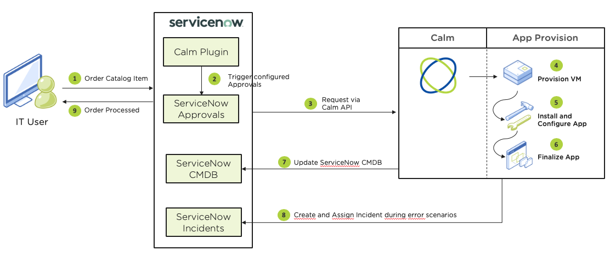

.. _calm_singlevm_blueprint:

-----------------------------
Self-Service with ServiceNow
-----------------------------

.. note::

  Estimated time to complete: **30 MINUTES**

Overview
++++++++

This workshop is concerned with the Calm ServiceNow Plug-in. Using the Calm serviceNow plug-in Calm provides self-service capabilities via ServiceNow.

In this Lab we will discuss how the Calm ServiceNow Plug-in is set-up, important concepts and step by step guide of how the integration works.

About ServiceNow
++++++++++++++++

ServiceNow is a cloud-based service platform providing IT Business Management (ITBM), IT Service Management (ITSM), IT Operations Managament (ITOM). ITSM is concerned with how service are delivered by IT teams while ITOM focuses more on the precesses IT use to manage themselves.

ServiceNow is a market leader in ITSM and ITOM and for many customer ITSM and ITOM are very much embeded in the organisation and serve as the end-customer and IT entry point for requesting and elivering IT services. Large investments are made in to these corporate solutions as they support the business processes based often on ITIL.

.. figure:: images/calm_servicenow_01.png

Calm ServiceNow Plug-in Overview
+++++++++++++++++++++++++++++++++

   - Provide integration with ServiceNow Service Portal for user self-service of Calm BP or Marketplace items
   - Plugin allows ServiceNow admins to create catalog items based on Calm blueprints 
   - ServiceNow users can launch blueprints and perform day-2 operations
   - ServiceNow admins can attach any specific workflow to ServiceNow Calm catalog,
   - ServiceNow catalog items can be created from a blueprint (Single/Multi-VM) on any supported profile; published (i.e., marketplace items) or unpublished blueprints can be used
   - ServiceNow admin can pre-fill “runtime” values in ServiceNow catalog item, reducing launch complexity 
   - ServiceNow catalog items are published using ServiceNow user/groups RBAC framework (Calm and ServiceNow must share the same authentication source)
   - Runlogs can be tracked in ServiceNow GUI under Applications
   - Orders and Incidents relating to Calm operations can be tracked in ServiceNow

Calm ServiceNow Plug-in Setup
++++++++++++++++++++++++++++++

Prerequisites for Nutanix Calm ServiceNow Plug-in

   - Nutanix Calm and ServiceNow both must be configured with the same AD or LDAP instance.
   - ITSM license that includes incident management module. The license is used to create incidents to report  blueprint and other events launch failures.
   .. note::
   Without ITSM license, installation of application from the store does not work as this dependency is bundled
with the application.
   - ServiceNow MID server must be installed and configured. For information on how to install and configure MID server, refer to the MID Server section in the ServiceNow Documentation. To refer to a video about setting up a MID server, https://www.youtube.com/watch?v=Pgi3WZAqmq0
   - Ensure that the MID server is running in your environment. Calm is reachable from the machine or environment where MID server is installed.
   - The MID server user has administrator privileges.
   - The MID server is up and validated.
   - To activate the Calm plug-in on ServiceNow platform, contact your instance ServiceNow administrator.
   - You must have administrator privileges to activate and configure the plug-in. Provide integration with ServiceNow Service Portal for user self-service of Calm BP or Marketplace items

.. figure:: images/calm_servicenow_03.png

Instance Details
++++++++++++++++

In this excercise we have provided an instance which maybe used at anytime after the excercise to demonstrate to customerser and prospects.

   - ServiceNow Instance: https://ven03030.service-now.com
   - Admin Login: admin/Nutanix!@123 (to create catalogue item)

This ServiceNow instance is connected with https://calm-demo.nutanix.com:9440 instance.

Create Catalogue Instance
+++++++++++++++++++++++++

#. Navigate to **+ Nutanix Calm > Catalog Items**. Click on the **New** button to create a new
catalog item

   .. note::

      - When the sync job is running, options to create/edit a catalog item is disabled since CMDB is being updated by the sync job
      - Use the Catalog Management menu under Nutanix Calm in the left navigation bar
      - Ensure your scope is “Nutanix Calm” as indicated in the screen shot belowMousing over an icon will display its title.

.. figure:: images/calm_servicenow_04.png

#. Click **+ Create Blueprint > Single VM Blueprint**.

#. Fill out the following fields:

   - **Name** - *initials*-CalmSingle
   - **Project** - *initials*-Calm

   .. figure:: images/calm_singlevm_01.png

#. Click **VM Details >**

#. Fill out the following fields:

   - **Name** - 

     .. code-block:: text
       
       CentOSAHV

   - **Cloud** - *Nutanix*
   - **Operating System** - *Linux*

   .. figure:: images/calm_singlevm_02.png

#. Click **VM Configuration >**

#. Fill out the following fields:

   - **VM Name** - 

     .. code-block:: text
       
       @@{USER_INITIALS}@@-centos-@@{calm_time}@@

   .. note::
      This defines the name of the virtual machine within Nutanix. We are using macros (case sensitive) to use the variables values as inputs. This approach can be used to meet your naming convention. Macros are defined using **@@{}@@**

   - **vCPUs** - *2* - Enable *runtime* (Runtime is specified by toggling the Running Man icon to Blue)
   - **Cores per vCPU** - *1*
   - **Memory (GiB)** - *4*
   - Select **Guest Customization**
   
     - Leave **Cloud-init** selected and paste in the following script
   
       .. code-block:: bash
   
         #cloud-config
         users:
           - name: centos
             sudo: ['ALL=(ALL) NOPASSWD:ALL']
         chpasswd:
           list: |
             centos:@@{PASSWORD}@@
           expire: False
         ssh_pwauth: True
   
   .. figure:: images/calm_singlevm_04.png
   
   - **Image** - CentOS-7-x86_64-GenericCloud
   - Select **Bootable**

   .. figure:: images/calm_singlevm_05.png

   - Select :fa:`plus-circle` along **Network Adapters (NICs)**
   - **NIC 1** - Primary
   
   .. figure:: images/calm_singlevm_05b.png

#. Click **App variables (0) >**

#. Add the following variables (**Runtime** is specified by toggling the **Running Man** icon to Blue):

   +------------------------+-------------------------------+------------+-------------+
   | **Variable Name**      | **Data Type** | **Value**     | **Secret** | **Runtime** |
   +------------------------+-------------------------------+------------+-------------+
   | USER_INITIALS          | String        | xyz           |            |      X      |
   +------------------------+-------------------------------+------------+-------------+
   | PASSWORD               | String        |               |     X      |      X      |
   +------------------------+-------------------------------+------------+-------------+

   .. figure:: images/calm_singlevm_03.png

#. Click **Done**

#. Click **Save**

#. Click **Launch** at the top of the Blueprint Editor.

#. Fill out the following fields:

   .. note::
      A single Blueprint can be launched multiple times within the same environment but each instance requires a unique **Application Name** in Calm.

   - **Name of the Application** - *initials*-CalmCentOS-1
   - **USER_INITIALS** - *initials*
   - **PASSWORD** - *any password*

#. Click **Create**

   .. figure:: images/calm_singlevm_06.png

   You will be taken directly to the **Applications** page to monitor the provisioning of your Blueprint.

#. Click **Audit > Create** to view the progress of your application.

#. Click **Substrate Create > CentOSAHV - Provision Nutanix** to view the real time output of the provisioning.

   .. figure:: images/calm_singlevm_07.png

   Note the status changes to **Running** after the Blueprint has been successfully provisioned.

   .. figure:: images/calm_singlevm_08.png

Takeaways
+++++++++

- The Single VM Blueprint Editor provides a simple UI for modeling IaaS blueprints in less than five minutes.
- Blueprints are tied to SSP Projects which can be used to enforce quotas and role based access control.
- Variables allow another dimension of customizing an application without having to edit the underlying Blueprint.
- There are multiple ways of authenticating to a VM (keys or passwords), which is dependent upon the source image.
- Virtual machine status can be monitored in real time.

.. |proj-icon| image:: ../images/projects_icon.png
.. |mktmgr-icon| image:: ../images/marketplacemanager_icon.png
.. |mkt-icon| image:: ../images/marketplace_icon.png
.. |bp-icon| image:: ../images/blueprints_icon.png
.. |blueprints| image:: images/blueprints.png
.. |applications| image:: images/blueprints.png
.. |projects| image:: images/projects.png
